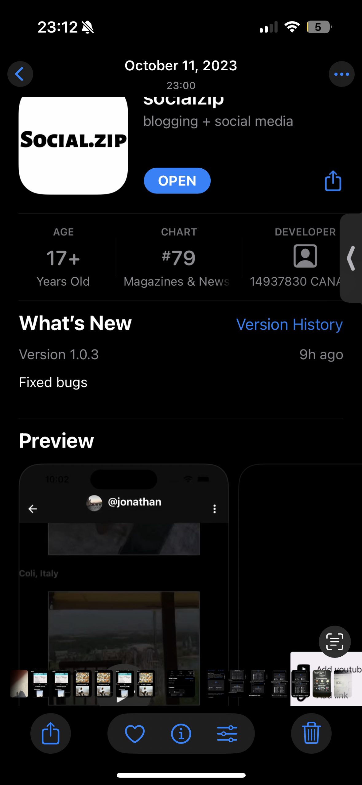

# Social.zip  
**Social Media App (2022–2023)**  

[Tiktok](https://www.tiktok.com/@social..zip)

  

**Status:** Coming Soon/Not Open Source Yet  

## Description
A cross platform (web, android, ios) social media app that supports creation of webpages that can contain (videos, images, stylized text)

## Key Features
- Collaborate filtering
- Friend recommendation
- Efficent searching using vector simularity
- Infinite scrolling using content windowing
- (GIF, PNG) in profile
- All postable continueable image forms (images, html, seeded videos)
- Infinite Comments
- Private signed images
- Blocking features
- Private accounts / friends
- Name changing and unique usernames

## Technology Stack
app is built with a modern and scalable tech stack:  

**TypeScript** 
– Type-safe codebase for maintainability and reliability.  
**Node.js**
- A node.js backend that uses express and graphql to handle requests
**GraphQL** 
– Maintainable readable queries 
**AWS DynamoDB** 
- Scalable NoSQL database for fast and reliable storage. (DynamoDB)  
- High availability storage with secure signing (S3)
    - App backups
**Google Cloud Storage (GCS)** 
– Horizontal scaling for servers 
**React Native** 
– Cross-platform mobile app development.  
**VectorDB (Weaviate)** 
– Semantic search and vector embeddings.  
**OAuth Passport** 
- Authentication via Google, Apple, and Facebook.  
**Cohere** 
– Tokenization and natural language processing.  
**Neo4j Graph Database** 
– For social graph and relationship data modeling (friend recomendation, faster queries)
**Mixpanel**
- For checking usage

## Demo

Note: This app is currently private and not open-source. Stay tuned...
